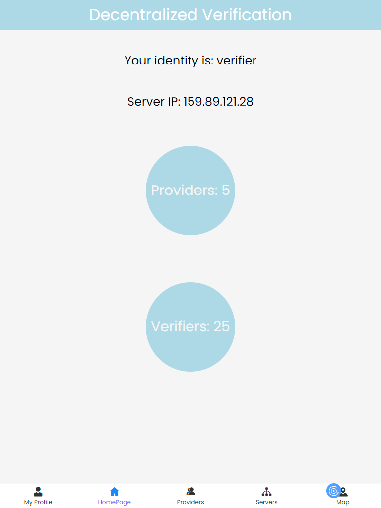
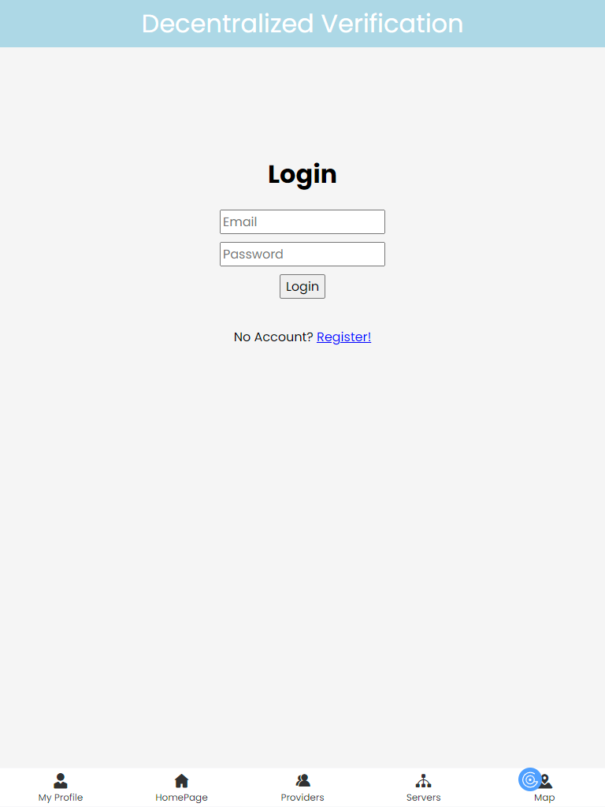
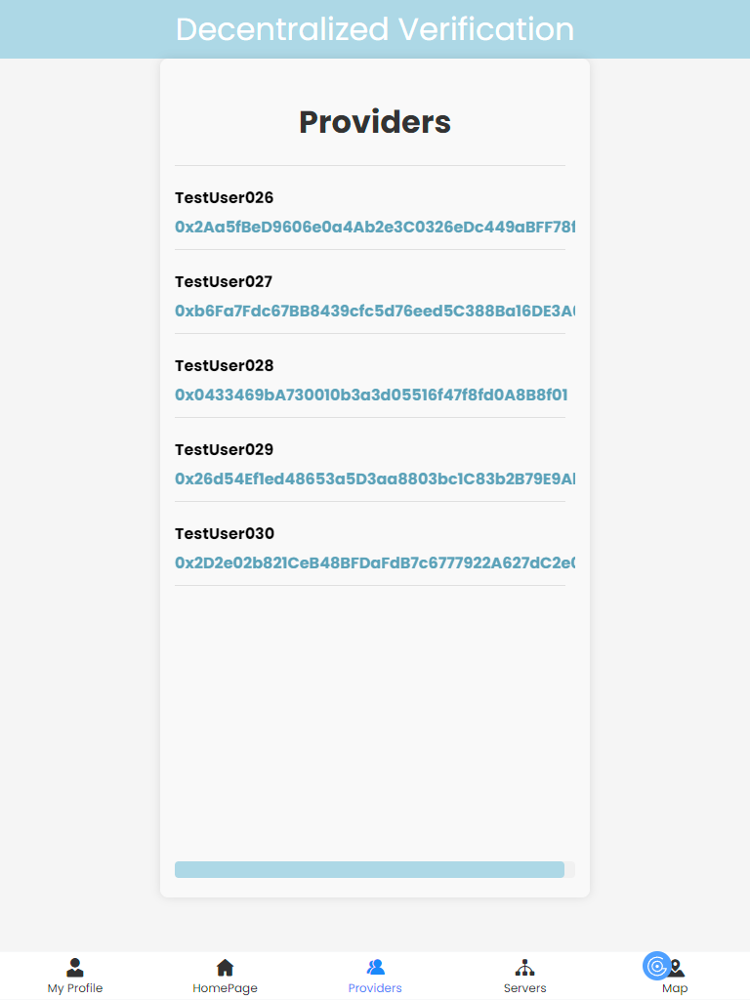
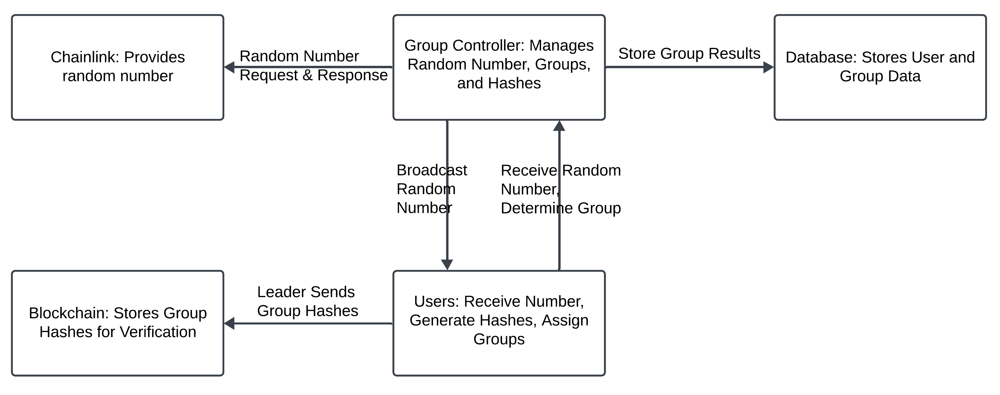
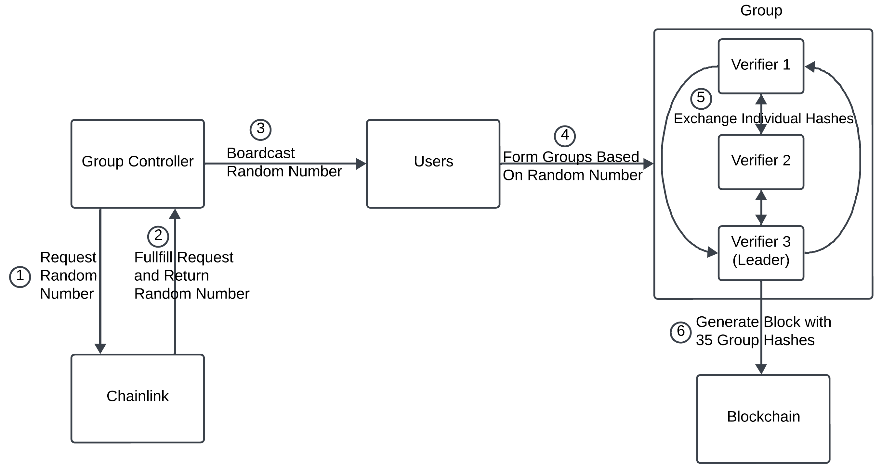
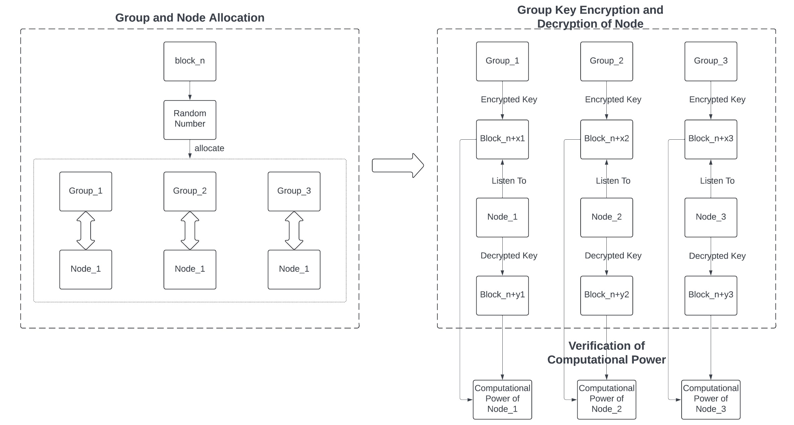

# Decentralized Computational Resource Verification Network

This repository contains the code for the Decentralized Computational Resource Verification Network. This project allows users to register, login, and participate in remote computational resource verification process. It supports group formation and leader selection based on a random number generated using Chainlink. The leader of each group generates a encrypted group hash consists of 35 hashes and send it to blockchain, and the provider of each group listen for the group hash and attemps to decrypt it. The extent to which the computational resource provider can decrypt is used to evaluate the power of it's computational resource.  
The application is built with Node.js, Vue, MongoDB, and Solidity, and it runs on DigitalOcean using Nginx and PM2.  


## Table of Contents

- [Architecture](#architecture)
- [Prosess Flow](#process-flow)
- [Prerequisites](#prerequisites)
- [Installation](#installation)
- [Setup](#setup)
  - [Step 0: System Update and Node.js Installation](#step-0-system-update-and-nodejs-installation)
  - [Step 1: Clone the Repository](#step-1-clone-the-repository)
  - [Step 2: Move to the Target Directory](#step-2-move-to-the-target-directory)
  - [Step 3: Install Docker and Run MongoDB](#step-3-install-docker-and-run-mongodb)
  - [Step 4: Start the Backend with PM2](#step-4-start-the-backend-with-pm2)
  - [Step 5: Setup Nginx](#step-5-setup-nginx)
  - [Step 6: Update Environment Variables](#step-6-update-environment-variables)
  - [Step 7: Manage Git](#step-7-manage-git)
 
- [Acknowledgments](#acknowledgments)

## Architecture
  

## Process Flow
  
  

## Prerequisites

Before you begin, ensure you have the following installed on your server:

- Ubuntu (latest version recommended)
- Node.js v18.20.3
- PM2
- Docker
- Nginx

## Installation

Follow these steps to set up the application on a new server.

### Step 0: System Update and Node.js Installation

Update the system and install necessary packages:

```
sudo apt update
sudo apt upgrade -y
sudo apt install -y curl gnupg2 ca-certificates lsb-release


# Install Node.js using NVM
curl -o- https://raw.githubusercontent.com/nvm-sh/nvm/v0.39.3/install.sh | bash
export NVM_DIR="$([ -z "\${XDG_CONFIG_HOME-}" ] && printf %s "\${HOME}/.nvm" || printf %s "\${XDG_CONFIG_HOME}/nvm")"
[ -s "$NVM_DIR/nvm.sh" ] && \. "$NVM_DIR/nvm.sh"
nvm --version
nvm install v18.20.3
nvm alias default v18.20.3

# Install PM2 globally
npm install -g pm2
```

### Step 1: Clone the Repository

Clone the repository from GitHub:

```
git clone https://github.com/yourusername/EtherVerifierSystem.git
```

### Step 2: Move to the Target Directory

Move the project to \`/var/www\`:

```
sudo mkdir -p /var/www/EtherVerifierSystem
sudo mv /root/EtherVerifierSystem /var/www/
sudo chown -R www-data:www-data /var/www/EtherVerifierSystem
sudo chmod -R 755 /var/www/EtherVerifierSystem
cd /var/www/EtherVerifierSystem
```

### Step 3: Install Docker and Run MongoDB

Install Docker and start MongoDB in a Docker container:

```
sudo apt install -y docker.io
sudo systemctl start docker
sudo systemctl enable docker
sudo docker run -d --name mongodb -p 27017:27017 mongo:4.4.29
```

### Step 4: Start the Backend with PM2

Start the backend server using PM2:

```
cd backend
pm2 start server.js --name "ether-verifier-backend"
pm2 save
pm2 startup
pm2 status
pm2 logs ether-verifier-backend
```

### Step 5: Setup Nginx

Install and configure Nginx:

```
sudo apt install -y nginx
sudo nano /etc/nginx/sites-available/default
```

Set the configuration similar to the existing setup.  Example:
```
server {
        listen 80;
        server_name 159.89.121.134;

        root /var/www/EtherVerifierSystem/frontend/jwtusersystem/dist;

        index index.html;


        location / {
                try_files $uri $uri/ /index.html;
        }

        location /api/ {
                proxy_pass http://localhost:5005;                
                proxy_http_version 1.1;
                proxy_set_header Upgrade $http_upgrade;
                proxy_set_header Connection 'upgrade';
                proxy_set_header Host $host;
                proxy_set_header X-Real-IP $remote_addr;
                proxy_set_header X-Forwarded-For $proxy_add_x_forwarded_for;
                proxy_cache_bypass $http_upgrade;
                proxy_set_header X-Forwarded-Proto $scheme;
        }
        location = /50x.html {
                root /usr/share/nginx/html;
        }
}

```

Then, build the frontend and restart Nginx:

```
cd frontend/jwtusersystem
npm run build
sudo nginx -t
sudo systemctl restart nginx
```


### Step 6: Update Environment Variables

Update the \`.env\` files with the server IP for both the frontend and backend.  
Example:  
\`backend/.env\`: 
```
PORT=5005
SERVER_IP=159.89.121.134
WALLET_ADDRESS=your-wallet-address
MONGO_URI=mongodb://[your-server-ip]:27017/usersystem
JWT_SECRET=your-jwt-secret
INFURA_URL="your-infura-url"
PRIVATE_KEY="your-private-key"
DB_SERVER_IP="159.89.121.134"
DB_USERNAME=adminUser
DB_PASSWORD=adminPassword
```
\`frontend/.env\`: 
```
VITE_SERVER_IP=159.89.121.134
LOAD_BALANCER_URL=http://159.89.117.145
```
Be aware that VITE_SERVER_IP and SERVER_IP is the ip of the server that frontend and backend is running on.  

### Step 7: Manage Git

Ensure local artifacts are not updated in the repository:

```
git rm --cached backend/.env
git rm --cached frontend/jwtusersystem/.env
git rm -r --cached frontend/jwtusersystem/dist
git rm -r --cached backend/build
git rm -r --cached backend/node_modules
git rm -r --cached frontend/jwtusersystem/node_modules
```

## Contact
For any issues or questions, please open an issue in the GitHub repository or contact hxf2023@ece.ubc.ca.

## Acknowledgments
- **Xiaofan He**, [Department of Electrical and Computer Engineering](https://ece.ubc.ca/), [University of British Columbia](https://www.ubc.ca/)
- **Dr. Zehua Wang**, [Department of Electrical and Computer Engineering](https://ece.ubc.ca/), [University of British Columbia](https://www.ubc.ca/)
